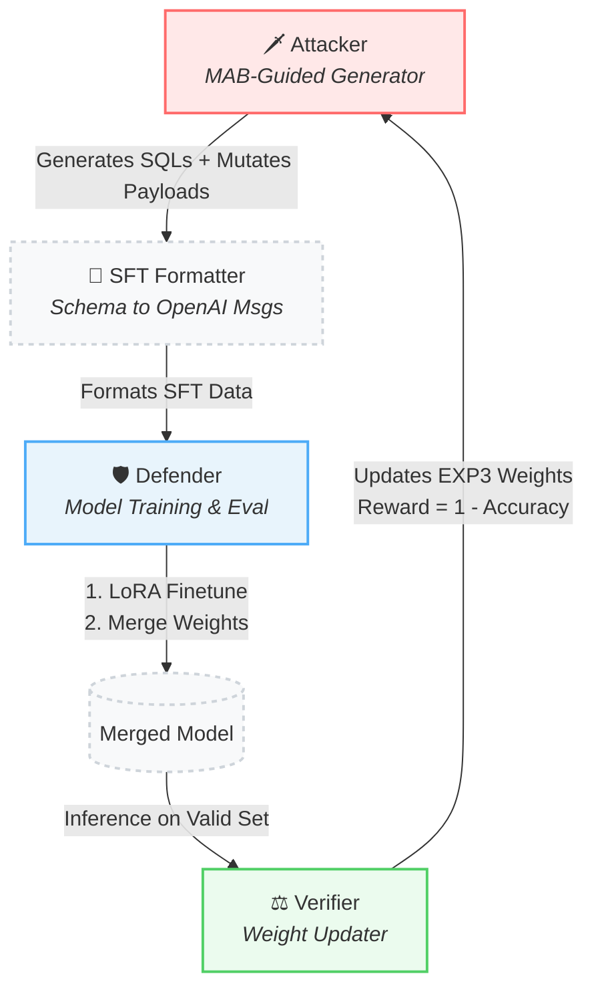

<div align="center">

# 🛡️ SQLI
**Adversarial Training Framework for SQL Injection Detection**

[](https://www.python.org/)
[]()
[]()

</div>

---

**SQLI** is a robust adversarial training framework designed to iteratively enhance a Large Language Model's (LLM) ability to detect SQL injection attacks. By simulating a continuous arms race between an **Attacker** and a **Defender**, guided by a Multi-Armed Bandit algorithm, the model naturally focuses its learning on its weakest vulnerabilities.

## 🌟 Core Architecture

The framework operates in an automated, closed-loop cycle consisting of three primary agents:



### How a Round Works:
1. **Attacker**: Samples attack clusters based on EXP3 probabilities. Generates injection SQLs (optionally mutating payloads via an LLM to increase diversity) and mixes them with benign samples.
2. **SFT Formatter**: Pairs each SQL query with its corresponding database schema and formats the data into OpenAI-style conversational SFT data.
3. **Defender**: Fine-tunes the base model (e.g., *Qwen2.5-Coder-1.5B*) using LoRA, merges the trained adapter into the base weights, and runs inference evaluations.
4. **Verifier**: Computes per-cluster accuracy from the Defender's inference results. It calculates EXP3 rewards (`1 − accuracy`) and updates cluster weights, ensuring the next round forces the model to confront its weakest areas.

---

## 📂 Directory Structure

```text
SQLI/
├── config/                          # ⚙️ YAML configuration files
│   ├── training_config.yaml         # Fine-tuning hyperparameters
│   ├── inference_config.yaml        # Inference settings
│   ├── gpt_config.yaml              # LLM API config (for payload mutation)
│   ├── database_connection.yaml     # MySQL connection details
│   ├── runtime_config.yaml           # Local model and training-output paths
│   ├── accelerate_single_gpu.yaml   # Current one-GPU Accelerate configuration
│   └── fsdp_config.yaml             # Optional multi-GPU FSDP configuration
├── data/                            # 📊 Datasets and Materials
│   ├── raw_datas_for_generation/    # Raw SQLs, schemas, and payload templates
│   └── benchmark/                   # Training/Testing benchmark datasets
├── ddl/                             # 🗄️ Reference DDL scripts for databases
├── prompt_templates/                # 📝 Prompt files (e.g. generate_comment.j2)
└── src/                             # 💻 Source Code
    ├── main.py                      # Multi-round training entry point
    ├── Attacker/                    # Attack-cluster sampling and generation strategy
    ├── Defender/                    # Model-improvement workflow orchestration
    ├── Verifier/                    # Acc metrics & MAB weight processing
    ├── synthesis/                   # SQL template filling, mutation, and SFT formatting
    ├── model_ops/                   # LoRA fine-tuning, merging, and inference
    └── utils/                       # Shared clients, serialization, and clustering
```

---

## 🚀 Getting Started

### Prerequisites
- **Python:** 3.10 or higher
- **Hardware:** CUDA-capable GPU(s) (Framework tested with multi-GPU setups)
- **Database:** MySQL server (required for template filling with real schema data)
- **API:** Access to an OpenAI-compatible API (required if payload mutation is enabled)

### Installation

1. Clone the repository:
   ```bash
   git clone <repository-url>
   cd SQLI
   ```
2. Install the required dependencies:
   ```bash
   pip install -r requirements.txt
   ```

---

## ⚙️ Configuration

Before running the framework, ensure the files in the `config/` directory are properly configured:

| Configuration File | Description |
|--------------------|-------------|
| `training_config.yaml` | Controls GPU allocation, batch size, LoRA params (rank/alpha/dropout), learning rate, and accelerate paths. |
| `inference_config.yaml` | Sets inference batch size, temperature, seq length, and target device. |
| `gpt_config.yaml` | Stores LLM API keys and model names used by the Attacker for payload mutation. |
| `database_connection.yaml`| Credentials for the MySQL template database. |
| `runtime_config.yaml` | Local base-model directory and the dedicated directory for round outputs. |
| `accelerate_single_gpu.yaml` | Single-GPU Accelerate configuration used by the current training setup. |
| `fsdp_config.yaml` | Multi-GPU distributed training configuration. |

### Key Training Parameters (`src/main.py`)
You can tweak the core loop behaviour directly in `main.py`:
- `NUM_ROUNDS = 8`: Total adversarial training iterations.
- `NUM_TRAINING_SQLS = 300`: Volume of samples generated per round.
- `ATTACKER_GAMMA = 0.7` / `VERIFIER_GAMMA = 0.3`: MAB exploration/learning rates.
- `ENABLE_PAYLOAD_MUTATION = True`: Toggles dynamic LLM-based SQL payload mutations.

---

## 💻 Usage

### Launching the Full Adversarial Loop
To run the automated Attack-Defend-Verify loop across all configured rounds:
```bash
cd SQLI
python src/main.py
```

On Slurm clusters where MySQL is deployed as a job-local service, first run a
sidecar preflight and then submit the full loop through the provided script:

```bash
SQLI_MODE=db-check sbatch scripts/sqli_slurm_job.sh
SQLI_MODE=generate-smoke sbatch scripts/sqli_slurm_job.sh
SQLI_MODE=mutation-smoke sbatch scripts/sqli_slurm_job.sh
SQLI_MODE=refactor-smoke sbatch scripts/sqli_slurm_job.sh
SQLI_MODE=full SQLI_MAIN_ARGS="--num-rounds 1 --num-training-sqls 12" \
    sbatch scripts/sqli_slurm_job.sh
```

The script starts MySQL on the allocated compute node, checks the configured
read-only account, and shuts down only the MySQL process it started. The MySQL
data directory must not be in use by another server when the job begins.
`refactor-smoke` does not call the LLM API or train a model; it validates the
refactored package boundaries and performs one database-specific synthesis.

*🔥 Tip: You can resume training from a specific breakpoint by modifying the `breakpoint_round` argument in `main.py` -> `run_training_loop(start_round=0, breakpoint_round=3)`.*

### Running Individual Components Manually

If you need to isolate specific behaviors, you can run the Defender scripts individually:

**1. Fine-Tune (via Accelerate):**
```bash
accelerate launch --config_file config/fsdp_config.yaml \
    src/model_ops/finetune.py \
    --model_name_or_path /path/to/model \
    --train_file /path/to/train_data.jsonl \
    --output_dir /path/to/output \
    --use_lora --lora_rank 16
```

**2. Merge LoRA Adapter:**
```bash
python src/model_ops/merge_lora.py \
    --lora_model_name_or_path /path/to/adapter \
    --output_dir /path/to/merged \
    --save_tokenizer
```

**3. Run Inference:**
```bash
python src/model_ops/inference.py \
    --model_path /path/to/merged_model \
    --test_file /path/to/test_data.jsonl \
    --output_file /path/to/results.jsonl
```

---

## 🔬 Technical Deep-Dive

### Attack Cluster Taxonomy
SQL injection samples are dynamically categorised using a 4-dimensional space:
1. **Attack Type**: `Tautologies`, `Error-based`, `Union-query`, `Piggy-backed`, `Boolean Inference`, `Time Inference`.
2. **Annotator**: True / False.
3. **Information Features**: `constant`, `system information`, `specific database`.
4. **Comment**: True / False.

*Benign SQL samples are mapped to a static `normal||normal||normal||normal` key.*

### Multi-Armed Bandit (EXP3)
The framework mathematically guarantees the model confronts its weakest areas:
- **Reward Function**: $Reward = 1 - Accuracy$
- **Weight Update**: $W_{k} = W_{k} \times \exp(\frac{\gamma}{N} \times \frac{Reward_{k}}{Prob_{k}})$
- MAB heavily samples clusters with high weights (low detection accuracy) in subsequent rounds.

### LLM Payload Mutation
When enabled, the Attacker uses LLM capabilities to mutate SQL injection payloads on the fly:
- **Type-focused Mutation**: Alters the implementation technique of the attack.
- **Info-focused Mutation**: Alters the query structure seamlessly.
- Includes an 18-category memory system to prevent repetitive generations and employs anti-imitation few-shot prompting.

---

<div align="center">
<i>This project is developed for academic research and defensive security purposes.</i>
</div>
